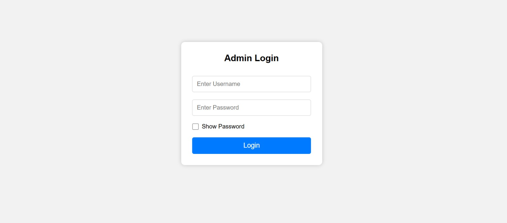
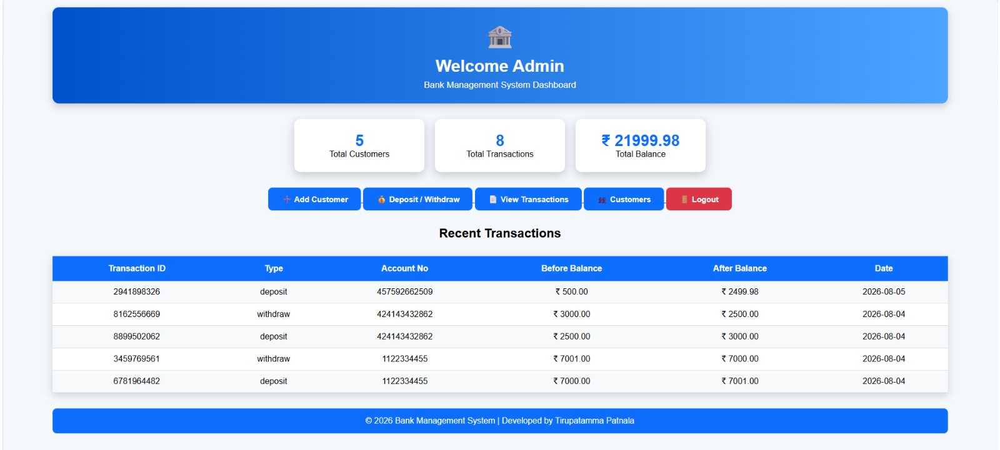
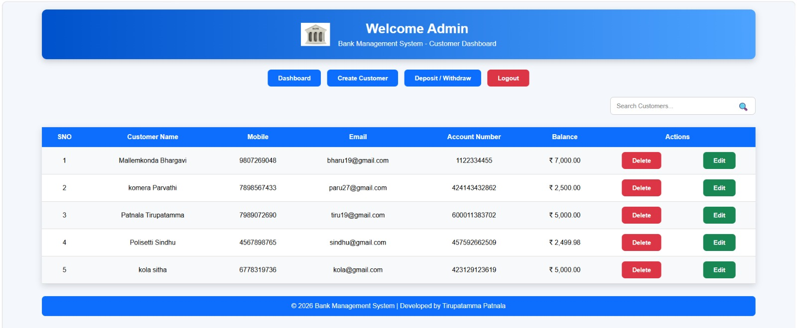
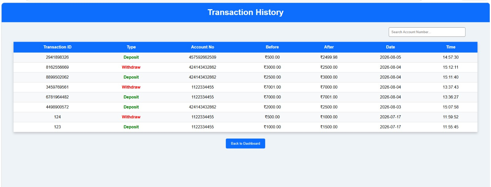

# 🏦 Flask Banking Management System

A simple and responsive Banking Management System built using **Python, Flask, MySQL, HTML, CSS, and Bootstrap**. This project allows administrators to manage customers, perform banking transactions, and monitor account details through a clean dashboard.

## 🚀 Features

- 🔐 Admin Login
- 👤 Add New Customer
- ✏️ Edit Customer Details
- 🗑️ Delete Customer
- 💰 Deposit Money
- 💸 Withdraw Money
- 📋 View All Customers
- 📊 Dashboard with Total Customers, Transactions & Total Balance
- 📜 Recent Transaction History
- 🔍 Search Customers
- 💻 Responsive User Interface

## 🛠️ Technologies Used

- Python
- Flask
- MySQL
- HTML5
- CSS3
- Bootstrap
- JavaScript

## 📂 Project Structure

```
Flask-Banking-Management-System/
│── app.py
│── requirements.txt
│── README.md
│── static/
│   ├── css/
│   ├── images/
│── templates/
│   ├── login.html
│   ├── dashboard.html
│   ├── customers.html
│   ├── transactions.html
│── database/
```

## ⚙️ Installation

1. Clone the repository

```bash
git clone https://github.com/tirupatnala-sys/Flask-Banking-Management-System.git
```

2. Navigate to the project

```bash
cd Flask-Banking-Management-System
```

3. Install dependencies

```bash
pip install -r requirements.txt
```

4. Configure MySQL database.

5. Run the application

```bash
python app.py
```

6. Open in browser

```
http://127.0.0.1:5000/
```

## ✨ Key Functionalities

- Customer Management (Create, Update, Delete)
- Banking Transactions (Deposit & Withdraw)
- Transaction History
- Dashboard Analytics
- Customer Search
- Secure Data Storage using MySQL

## 📸 Screenshots

- Login Page
- Dashboard
- Customer dashboard
- Transactions Page

# 🏦 Bank Management System

## Login Page



## Dashboard



## Customer Dashboard



## Transactions



## 👩‍💻 Developed By

**Tirupatamma Patnala**

### ⭐ If you like this project, don't forget to Star this repository.
